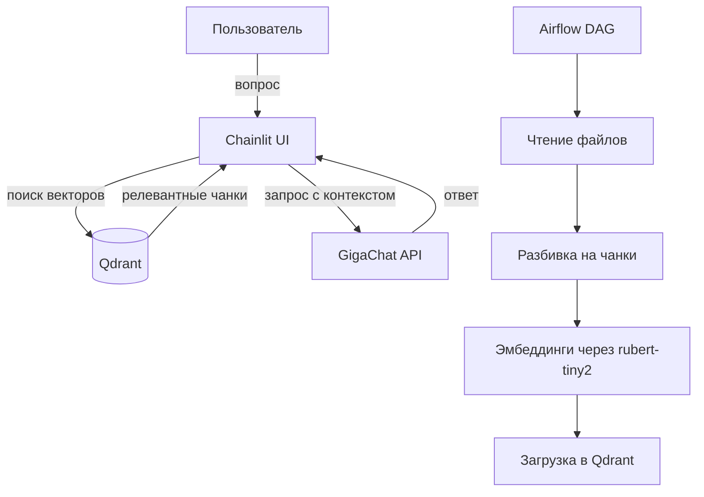

# RAG-ассистент

Сервис вопросно-ответной системы по локальной базе знаний с использованием RAG (Retrieval-Augmented Generation).  
Проект полностью контейнеризирован и поднимается одной командой.

## Задача

Разработать простейшего RAG-ассистента, который:
- Индексирует текстовые файлы из папки `data/` (разбивает на чанки, строит эмбеддинги с помощью локальной модели `cointegrated/rubert-tiny2` и сохраняет в Qdrant).
- При вопросе пользователя находит релевантные чанки, формирует промпт и отправляет во внешнюю LLM (GigaChat) для генерации ответа.
- Процесс оркестрируется через Apache Airflow (DAG для регулярной индексации).

## Принцип работы

## Стек технологий

| Компонент                   | Назначение в проекте                                                                                                                                                             |
|:----------------------------|:---------------------------------------------------------------------------------------------------------------------------------------------------------------------------------|
| **Python 3.10**             | Основной язык программирования                                                                                                                                                   |
| **Apache Airflow**          | Оркестрация ETL-процесса: запуск DAG для чтения файлов, разбивки на чанки, векторизации и загрузки в Qdrant по расписанию (daily)                                                |
| **Qdrant**                  | Векторная база данных для хранения эмбеддингов чанков и их метаданных, а также для выполнения быстрого поиска ближайших соседей (по косинусному сходству)                        |
| **Chainlit**                | Фреймворк для создания веб-интерфейса чата. Обеспечивает удобное взаимодействие с пользователем в реальном времени                                                               |
| **LangChain**               | Используется для работы с текстовыми сплиттерами (`RecursiveCharacterTextSplitter`) и интеграции с HuggingFace-моделями.                                                         |
| **sentence-transformers**   | Библиотека для загрузки и инференса локальной легковесной модели `cointegrated/rubert-tiny2`, которая преобразует текст в векторные представления (эмбеддинги)                   |
| **GigaChat API**            | Внешняя LLM (через REST API), которая получает сформированный промпт с контекстом и генерирует финальный ответ для пользователя                                                  |
| **PostgreSQL**              | Хранилище метаданных для Apache Airflow (история запусков DAG'ов, статусы задач, переменные окружения и настройки подключений)                                                   |
| **Docker & Docker Compose** | Контейнеризация всех сервисов и управление их зависимостями                                                                                                                      |