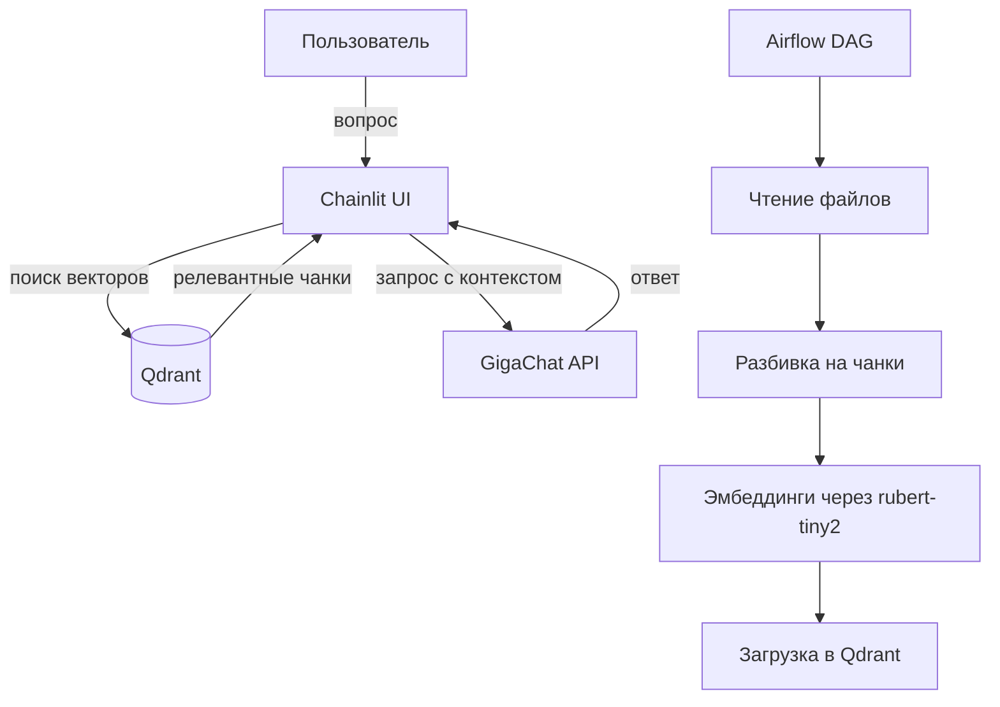
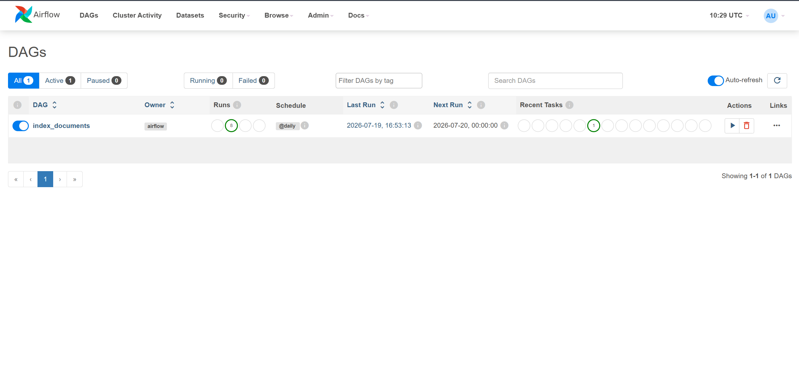
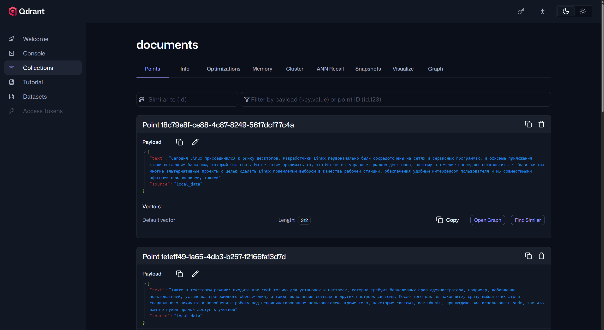
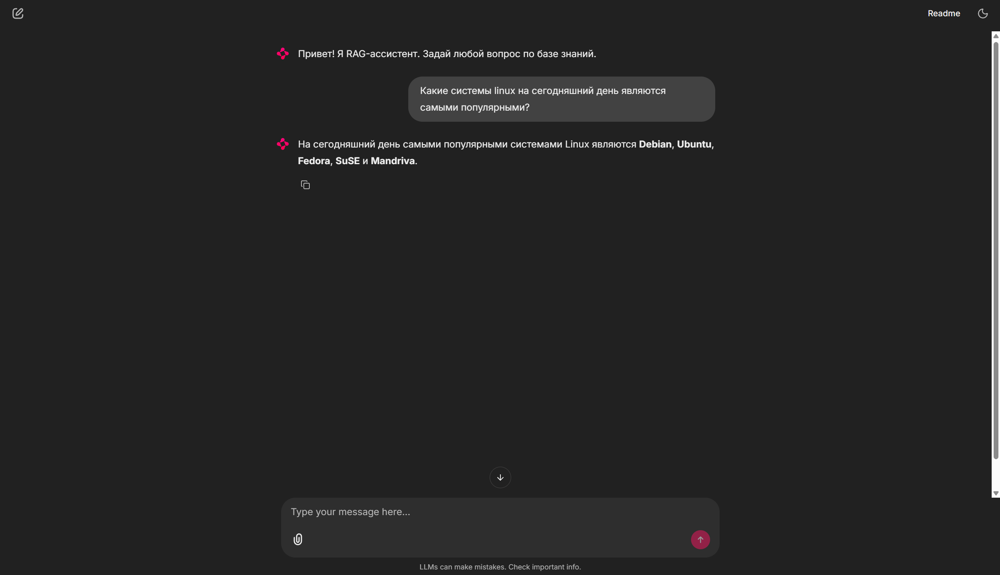
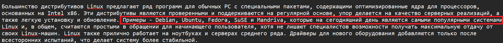
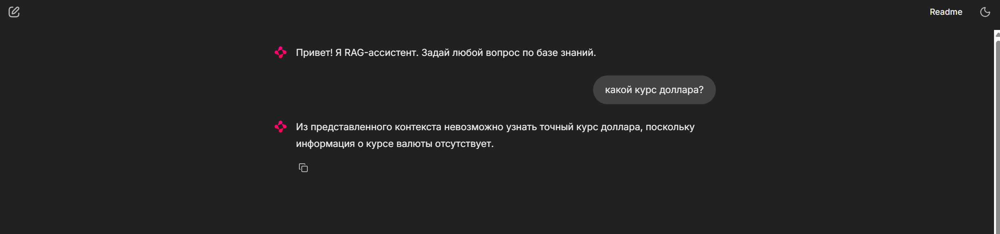
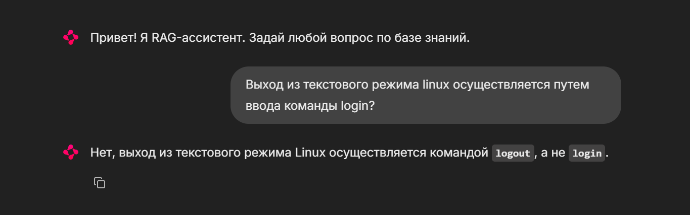
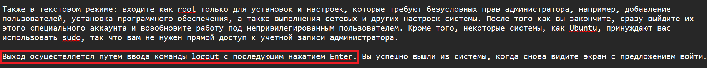

# RAG-ассистент

Сервис вопросно-ответной системы по локальной базе знаний с использованием RAG (Retrieval-Augmented Generation).  
Проект полностью контейнеризирован и поднимается одной командой.

## Задача

Разработать простейшего RAG-ассистента, который:
- Индексирует текстовые файлы из папки `data/` (разбивает на чанки, строит эмбеддинги с помощью локальной модели `cointegrated/rubert-tiny2` и сохраняет в Qdrant).
- При вопросе пользователя находит релевантные чанки, формирует промпт и отправляет во внешнюю LLM (GigaChat) для генерации ответа.
- Процесс оркестрируется через Apache Airflow (DAG для регулярной индексации).

## Принцип работы



## Стек технологий

| Компонент                   | Назначение в проекте                                                                                                                                                             |
|:----------------------------|:---------------------------------------------------------------------------------------------------------------------------------------------------------------------------------|
| **Python 3.10**             | Основной язык программирования                                                                                                                                                   |
| **Apache Airflow**          | Оркестрация ETL-процесса: запуск DAG для чтения файлов, разбивки на чанки, векторизации и загрузки в Qdrant по расписанию (daily)                                                |
| **Qdrant**                  | Векторная база данных для хранения эмбеддингов чанков и их метаданных, а также для выполнения быстрого поиска ближайших соседей (по косинусному сходству)                        |
| **Chainlit**                | Фреймворк для создания веб-интерфейса чата. Обеспечивает удобное взаимодействие с пользователем в реальном времени                                                               |
| **LangChain**               | Используется для работы с текстовыми сплиттерами (`RecursiveCharacterTextSplitter`) и интеграции с HuggingFace-моделями.                                                         |
| **sentence-transformers**   | Библиотека для загрузки и инференса локальной легковесной модели `cointegrated/rubert-tiny2`, которая преобразует текст в векторные представления (эмбеддинги)                   |
| **GigaChat API**            | Внешняя LLM (через REST API), которая получает сформированный промпт с контекстом и генерирует финальный ответ для пользователя                                                  |
| **PostgreSQL**              | Хранилище метаданных для Apache Airflow (история запусков DAG'ов, статусы задач, переменные окружения и настройки подключений)                                                   |
| **Docker & Docker Compose** | Контейнеризация всех сервисов и управление их зависимостями                                                                                                                      |

## Запуск

### 1. Клонируйте репозиторий

```bash
git clone https://github.com/DAKudryashev/local_rag.git
cd local_rag
```

### 2. Создайте и настройте `.env`

Скопируйте шаблон переменных окружения:

```bash
cp .env.example .env
```

Откройте `.env` и заполните реальными значениями.

### 3. Запустите все сервисы

Из корня проекта выполните:

```bash
docker compose up --build
```

**Первая сборка может занять 10–20 минут**, так как будут скачиваться:
- Образы контейнеров (Airflow, Qdrant, PostgreSQL);
- Python-библиотеки (PyTorch, transformers, и т.д.);
- Модель `rubert-tiny2` (около 1 ГБ) — она сохранится в общий том `hf_cache` и больше не будет перекачиваться.

После успешного запуска в терминале появятся логи всех сервисов.  
В браузере станут доступны:

| Сервис | URL | Логин / Пароль |
| :--- | :--- | :--- |
| **Airflow UI** | http://localhost:8080 | `airflow` / `airflow` |
| **Chainlit UI** | http://localhost:8000 | (без авторизации) |
| **Qdrant Dashboard** | http://localhost:6333/dashboard | — |

> 💡 Если порты 8000, 8080 или 6333 заняты, вы можете изменить их в `docker-compose.yml`.

## Пример использования

Для демонстрации работоспособности были взяты 5 текстовых файлов с информацией из русскоязычного руководства для Linux.

После запуска контейнера в окне Airflow UI можно увидеть информацию о DAG для подготовки данных из папки `data`:



Для нормального функционирования RAG-ассистента, необходимо чтобы задача выполнилась хотя бы один раз.
После того как это случится в дашборде Qdrant появится информация о пришедших данных:



Перейдем теперь на страницу Chainlit UI. Здесь мы увидим чат, где уже можем задавать вопрос:



Важно отметить, что выдаваемый ассистентом ответ полностью соответствует контексту, сформированному на основе локальной базы знаний:



Если задать ассистенту вопрос, ответ на который не содержится в базе знаний - он прямо об этом скажет:



Если задать ассистенту вопрос, относящийся к базе знаний, но заведомо содержащий неточность - он явно на это укажет:



(Доказательство из информационной базы):

.